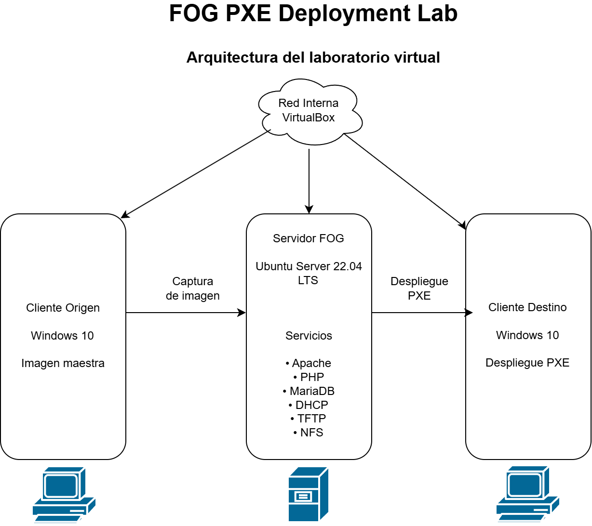

# 🚀 FOG PXE Deployment Lab

> Implementación de un laboratorio virtual para el despliegue automatizado de sistemas operativos mediante FOG Project y arranque PXE.

---

## 📖 Descripción

Este proyecto documenta el diseño, instalación y configuración de un laboratorio virtual basado en **FOG Project**, permitiendo la captura y el despliegue automatizado de imágenes de sistemas operativos mediante arranque PXE.

El laboratorio está completamente virtualizado utilizando **VirtualBox**, simulando un entorno empresarial o educativo donde múltiples equipos pueden instalarse desde un único servidor de forma centralizada.

## 📑 Índice

- [Descripción](#-descripción)
- [Características](#-características)
- [Tecnologías utilizadas](#-tecnologías-utilizadas)
- [Arquitectura](#-arquitectura)
- [Capturas](#-capturas)
- [Estructura del repositorio](#-estructura-del-repositorio)
- [Resultados](#-resultados)
- [Próximas mejoras](#-próximas-mejoras)
- [Autor](#-autor)

  ## ✨ Características

- Instalación de un servidor FOG sobre Ubuntu Server.
- Configuración del arranque PXE.
- Captura de imágenes de sistemas operativos.
- Despliegue automatizado en equipos cliente.
- Laboratorio completamente virtualizado mediante VirtualBox.
- Documentación paso a paso del proceso de implementación.

 ## 🏗️ Arquitectura del laboratorio

El entorno está compuesto por tres máquinas virtuales conectadas mediante una red interna de VirtualBox.

| Máquina | Función |
|---------|---------|
| Servidor FOG | Gestión de imágenes y servicios PXE |
| Cliente Origen | Equipo utilizado para capturar la imagen |
| Cliente Destino | Equipo utilizado para desplegar la imagen |

